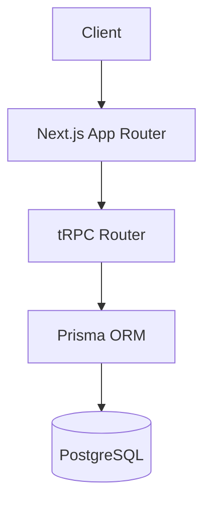

# VitePress Documentation

Guidelines for writing and maintaining project documentation using VitePress.

## When to Use

- Writing or updating project documentation after completing tickets
- Creating architecture overviews, API docs, component inventories
- Structuring sidebar navigation for new doc sections
- Adding code examples or diagrams to docs

## Project Structure

```
docs/
├── .vitepress/
│   └── config.ts          # Site config (title, sidebar, nav)
├── index.md               # Landing page
├── guide/
│   ├── index.md           # Guide overview
│   └── getting-started.md
├── architecture/
│   ├── index.md           # Architecture overview
│   ├── data-model.md      # Database schema & relationships
│   ├── api.md             # API routes & contracts
│   └── auth.md            # Auth flow
├── components/
│   └── index.md           # Component inventory
├── decisions/
│   └── index.md           # Links to ADRs
└── api/
    └── index.md           # API reference
```

## Frontmatter

Every doc page should include frontmatter:

```markdown
---
title: Page Title
description: Brief description for SEO and sidebar
---
```

For the landing page (`docs/index.md`), use the hero layout:

```markdown
---
layout: home
hero:
  name: "Project Name"
  text: "Tagline"
  actions:
    - theme: brand
      text: Get Started
      link: /guide/getting-started
    - theme: alt
      text: Architecture
      link: /architecture/
features:
  - title: Feature One
    details: Description
  - title: Feature Two
    details: Description
---
```

## Sidebar Configuration

Define sidebars in `.vitepress/config.ts`:

```typescript
import { defineConfig } from "vitepress";

export default defineConfig({
  title: "Project Docs",
  description: "Project documentation",
  themeConfig: {
    sidebar: [
      {
        text: "Guide",
        items: [{ text: "Getting Started", link: "/guide/getting-started" }],
      },
      {
        text: "Architecture",
        items: [
          { text: "Overview", link: "/architecture/" },
          { text: "Data Model", link: "/architecture/data-model" },
          { text: "API", link: "/architecture/api" },
          { text: "Auth Flow", link: "/architecture/auth" },
        ],
      },
      {
        text: "Components",
        items: [{ text: "Inventory", link: "/components/" }],
      },
    ],
    nav: [
      { text: "Guide", link: "/guide/" },
      { text: "Architecture", link: "/architecture/" },
      { text: "API", link: "/api/" },
    ],
  },
});
```

## Writing Conventions

### Headings

- `#` — Page title (one per page, matches frontmatter title)
- `##` — Major sections
- `###` — Subsections

### Code Blocks

Use language-specific fenced blocks with filenames:

````markdown
```typescript [src/server/routers/user.ts]
export const userRouter = router({
  getProfile: protectedProcedure.query(async ({ ctx }) => {
    return ctx.db.user.findUnique({ where: { id: ctx.userId } });
  }),
});
```
````

### Diagrams

VitePress supports Mermaid diagrams natively:

````markdown

````

### Containers

Use custom containers for callouts:

```markdown
::: tip
Helpful information here.
:::

::: warning
Important caveat here.
:::

::: danger
Critical warning here.
:::

::: info
Contextual information here.
:::
```

### Tables

Use standard markdown tables for structured data:

```markdown
| Endpoint         | Method | Auth     | Description    |
| ---------------- | ------ | -------- | -------------- |
| `/api/users`     | GET    | Required | List users     |
| `/api/users/:id` | GET    | Required | Get user by ID |
```

## Documentation Categories

### Architecture Docs (`architecture/`)

**Purpose:** Living system overview that evolves with the codebase.

**Must include:**

- System diagram (Mermaid) showing major components
- Data model with entity relationships
- API route inventory with auth requirements
- Auth flow (login, session, middleware)
- Key technical decisions (link to ADRs)

**Update triggers:** Schema changes, new API routes, new auth flows, new integrations.

### API Reference (`api/`)

**Purpose:** Complete API contract documentation.

**Per endpoint:**

- Route path and method
- Request body schema (TypeScript type or Zod schema)
- Response shape
- Auth requirements
- Error codes
- Example request/response

**Update triggers:** New tRPC procedures, changed request/response shapes.

### Component Inventory (`components/`)

**Purpose:** Catalog of reusable UI components.

**Per component:**

- Purpose and when to use
- Props interface
- Usage example
- Related components

**Update triggers:** New shared components, prop changes.

### Guide (`guide/`)

**Purpose:** Getting started and developer onboarding.

**Must include:**

- Local setup instructions
- Environment variables
- Development workflow
- Testing approach
- Deployment process

**Update triggers:** Setup changes, new tooling, process changes.

## Commands

```bash
# Development
bun run docs:dev        # Start dev server at localhost:5173

# Build
bun run docs:build      # Build static site to docs/.vitepress/dist

# Preview
bun run docs:preview    # Preview built site locally
```

## Integration with /work

After completing a ticket, the documentation subagent should:

1. Determine which doc categories are affected by the ticket
2. Spawn parallel subagents for each affected category
3. Each subagent reads the current doc, reads the changed source files, and updates the doc
4. Update the sidebar config if new pages were added

**Doc categories to check per ticket type:**

| Ticket involves...     | Update...                     |
| ---------------------- | ----------------------------- |
| Schema/migration       | `architecture/data-model.md`  |
| New API route/tRPC     | `architecture/api.md`, `api/` |
| Auth changes           | `architecture/auth.md`        |
| New shared component   | `components/`                 |
| Setup/tooling changes  | `guide/getting-started.md`    |
| New integration        | `architecture/` (new page)    |
| Architecture decisions | `decisions/` (link to ADR)    |
