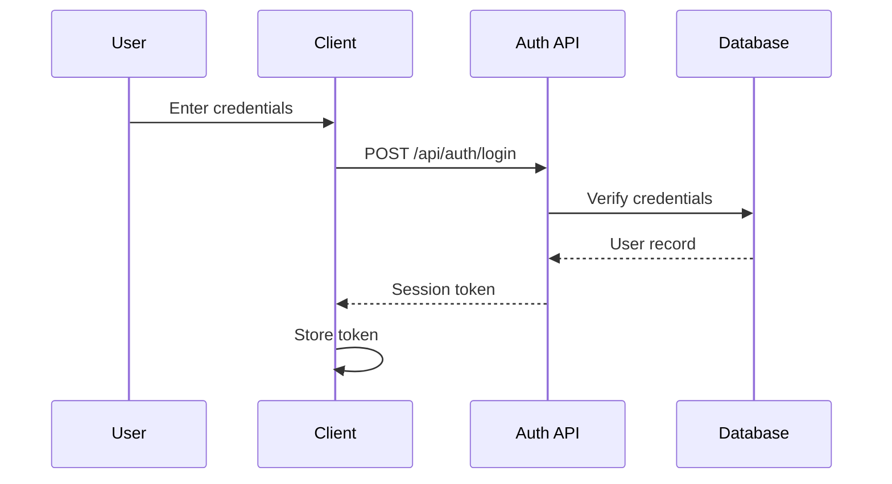

# Auth Flow

::: info
Auto-updated when authentication changes are committed.
:::

## Overview

## Auth Provider

To be determined — see spec decisions.

## Protected Routes

| Route Pattern | Auth Required | Role Required |
| ------------- | ------------- | ------------- |
| —             | —             | —             |

## Middleware

Authentication middleware will be documented here once implemented.
