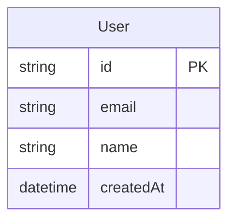

# Data Model

::: info
Auto-updated when schema changes are committed. Reflects the current Prisma schema.
:::

## Entity Relationship Diagram

::: tip
This diagram will grow as models are added during development.
:::

## Models

### User

The base user model created during authentication setup.

| Field       | Type     | Notes       |
| ----------- | -------- | ----------- |
| `id`        | String   | Primary key |
| `email`     | String   | Unique      |
| `name`      | String   | Optional    |
| `createdAt` | DateTime | Auto-set    |

## Migrations

| Migration | Date | Description |
| --------- | ---- | ----------- |
| —         | —    | None yet    |
