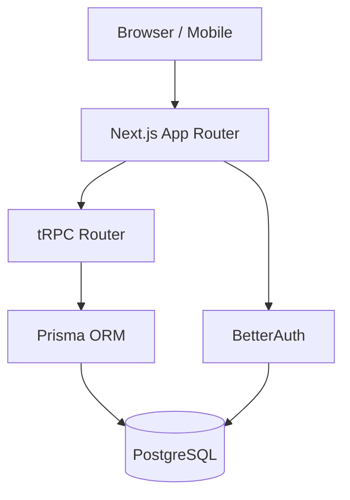
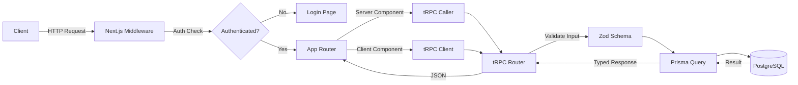

# Architecture Overview

::: info
This page is auto-updated as the system evolves. Diagrams and descriptions reflect the current state of the codebase.
:::

## System Diagram

## Tech Stack

| Layer      | Technology                   |
| ---------- | ---------------------------- |
| Framework  | Next.js 14+ (App Router)     |
| Runtime    | Bun                          |
| Database   | PostgreSQL                   |
| ORM        | Prisma                       |
| API        | tRPC                         |
| Auth       | BetterAuth (or as specified) |
| Styling    | Tailwind CSS + shadcn/ui     |
| Testing    | Vitest + Playwright          |
| Deployment | Vercel                       |

## Request Flow

## Sections

- [Data Model](./data-model) — Database schema and entity relationships
- [API](./api) — API routes, tRPC procedures, and contracts
- [Auth Flow](./auth) — Authentication and authorization
